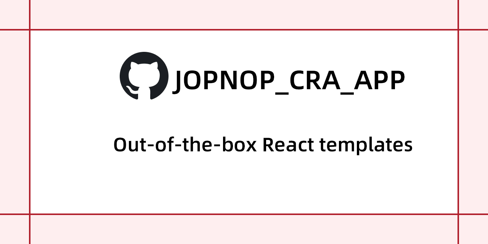

# JoyNop React Framework

- TypeScript & Antd & Less

1. `yarn add`  Install your dependencies

2. `yarn start` Start running your project

3. If you want to analyze certain files =>`yarn analyze`

4. If you want to use custom env, then I recommend custom configuration in `package.json` and configure the build option to achieve the purpose of custom variables, like`yarn build:a`

- Please don't use `eject` easily, it is irreversible and can provide you with the latest `react-scripts`

------

特性：

1. 全面支持`Typescript`

2. ANTD ,采用`Ant Design`，解决了@用户，时间组件，组件动态查询，表格分页请求展示，面包屑导航，状态弹窗等经常使用的问题（这样很大程度提高开发效率，也不用浪费时间兼容三方库）

3. 采用`Less/Css`之前是通过CSS IN JS的方式编写，导致过度依赖，不能兼容外部样式，解决因样式问题无法引用第三方组件，同时使用`Less`做样式，支持自定义变量，支持模块化引入Style

4. 对`ANTD`,等es常用库按需引入

5. 可根据代码业务量通过`Code Splitting`拆分代码

6. 无需单独设置`static`,通过`yarn build`后，`build`文件夹自动生`static`
    
    可直接上传到CDN，做CDN全球节点部署，解决网络拥塞问题，提高网站响应速度和可用性，降低源站压力，控制好缓存可预防源站宕机，影响用户访问 

7. 如果您需要通过外部变量控制接口访问，可通过`Dockerfile` 通过Docker运行获取变量脚本，通过脚本，执行build命令

8. 仅通过nginx,Caddy搭建简单的服务即可，减轻服务端压力

9. 支持vscode调试，断点，debugger ，F5即可

10. 将`LiveData`兼容至`IE11`

11. 增加对Redux的适配

  支持自定义变量 可通过如下命令进行测试

  
完美支持自定义环境变量

  
Windows (cmd.exe)

<pre><code> set "REACT_APP_NOT_SECRET_CODE=abcdef" && yarn start</pre></code> 
 

Windows (Powershell)

<pre><code>($env:REACT_APP_NOT_SECRET_CODE = "abcdef") -and (yarn start)</pre></code> 

Linux, macOS (Bash)

<pre><code>REACT_APP_NOT_SECRET_CODE=abcdef yarn start</pre></code> 

**支持eject，但不建议eject，通过`customize-cra`扩展`WebPack`,可以保证`react-scripts`的稳定性，不会因某些支持库版本问题影响整个项目，可以顺利升级`react-scripts`**
